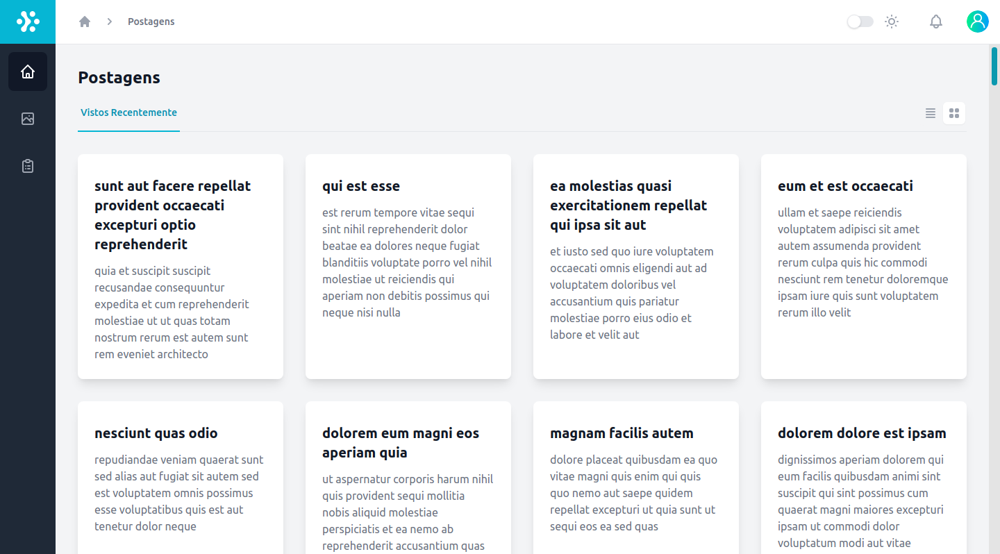
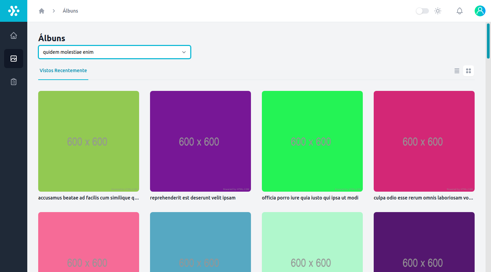
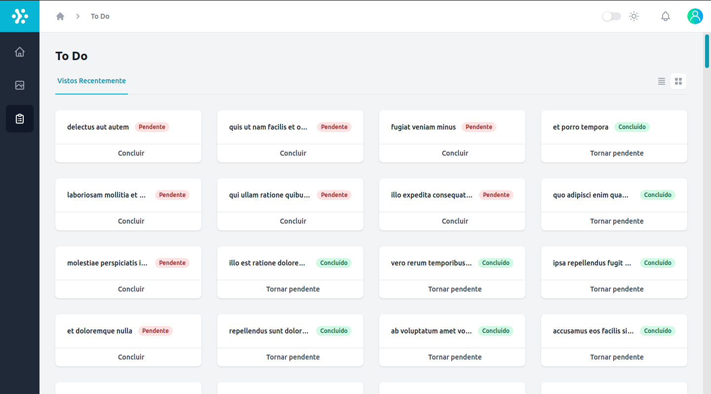
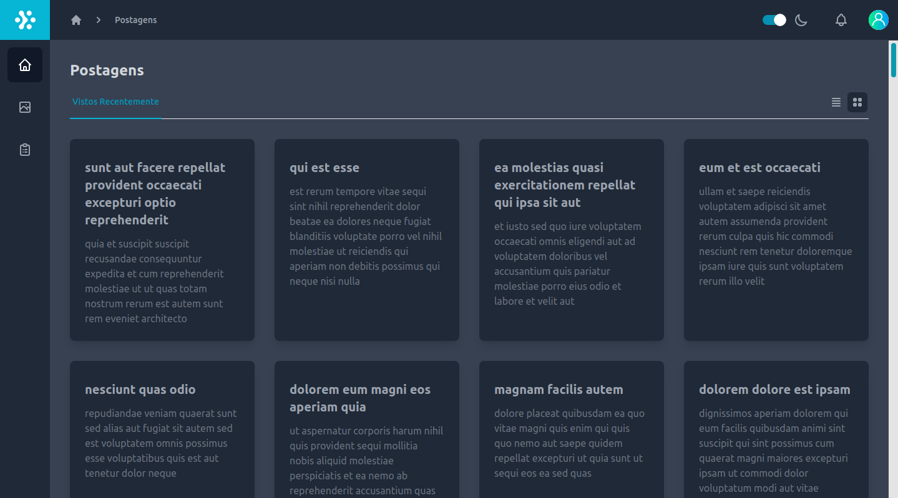

# Framework

## 💻 Projeto
#### Construa uma aplicação Web que irá utilizar as listagens de uma  API Rest.
Esta aplicação deve conter os menus e/ou páginas:
- POSTAGENS
- ÁLBUNS
- TO-DOs

A API a ser utilizada está publicada em [jsonplaceholder](https://jsonplaceholder.typicode.com/)

Utilizar React para desenvolver a aplicação.
## ✨ Tecnologias

-   [ ] React
-   [ ] Typescript
-   [ ] Tailwind
-   [ ] Context API
-   [ ] Hooks
-   [ ] .ENV
-   [ ] React Router DOM V6
-   [ ] Loadable Components
-   [ ] EsLint/Prettier

 

  

  

  

  

  

  

## 👨‍💻 Scripts Disponíveis

No diretório do projeto, você pode executar:

### `yarn start`

Executa o aplicativo no modo de desenvolvimento.\
Abra [http://localhost:3000](http://localhost:3000) para visualizá-lo no navegador.

A página será recarregada se você fizer edições.\
Você também verá quaisquer erros de lint no console.

### `yarn test`

Inicia o executor de teste no modo de observação interativo.\
Consulte a seção sobre [execução de testes](https://facebook.github.io/create-react-app/docs/running-tests) para obter mais informações.

### `yarn build`

Compila o aplicativo para produção na pasta `build`. \
Ele agrupa corretamente o React no modo de produção e otimiza a construção para o melhor desempenho.

A compilação é reduzida e os nomes dos arquivos incluem os hashes. \
Seu aplicativo está pronto para ser implantado!

Consulte a seção sobre [implantação](https://facebook.github.io/create-react-app/docs/deployment) para obter mais informações.

### `yarn eject`

**Nota: esta é uma operação unilateral. Depois de `ejetar`, você não pode voltar!**

Se não estiver satisfeito com a ferramenta de construção e as opções de configuração, você pode `ejetar` a qualquer momento. Este comando removerá a dependência de compilação única de seu projeto.

Em vez disso, ele copiará todos os arquivos de configuração e as dependências transitivas (webpack, Babel, ESLint, etc) diretamente em seu projeto para que você tenha total controle sobre eles. Todos os comandos, exceto `eject`, ainda funcionarão, mas eles irão apontar para os scripts copiados para que você possa ajustá-los. Neste ponto, você está sozinho.

Você nunca precisa usar `ejetar`. O conjunto de recursos selecionados é adequado para implantações pequenas e médias, e você não deve se sentir obrigado a usar esse recurso. No entanto, entendemos que esta ferramenta não seria útil se você não pudesse personalizá-la quando estiver pronto para ela.

## Versão Node
`16.13.1`

## Versão Npm
`8.1.2`